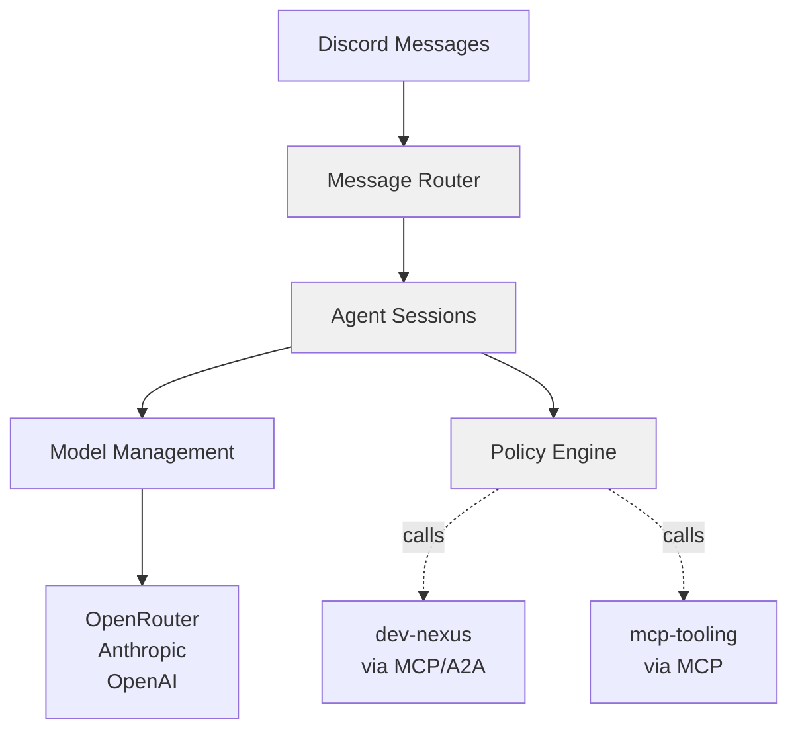
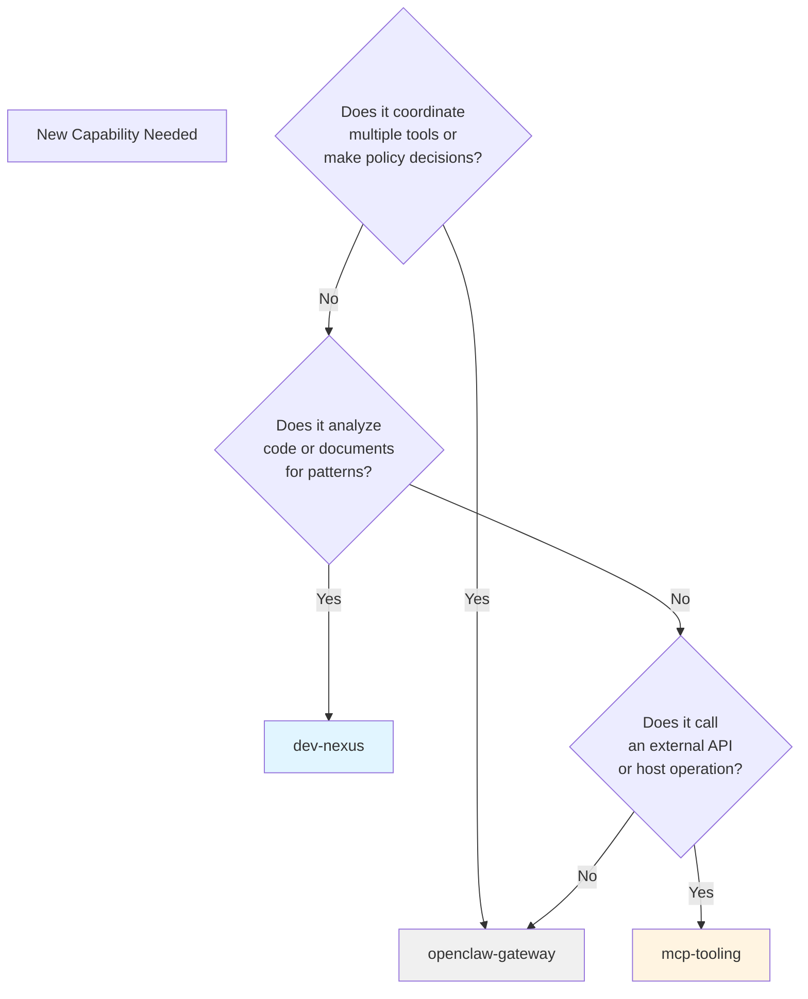
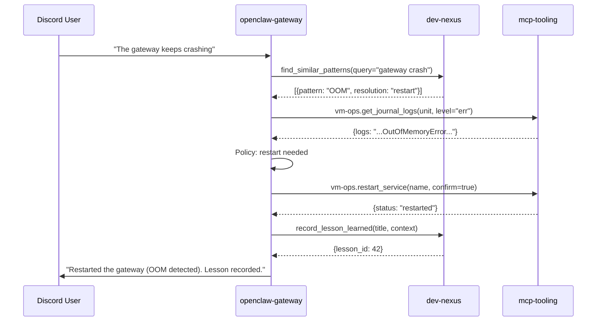

# Architectural Boundaries: openclaw-gateway

**Status:** CURRENT  
**Last Updated:** 2026-06-09  
**Next Review:** 2026-09-09  
**Owner:** openclaw-gateway Maintainers  
**Priority:** P0 (load-bearing)

---

## Purpose

This document defines the architectural boundaries for **openclaw-gateway (L3b)** — the agent runtime and orchestration layer in the OpenClaw ecosystem.

**Core responsibility:** Route messages to agents, coordinate tool calls, enforce policies — without implementing tool logic or analyzing patterns.

**Related documents:**
- [dev-nexus architectural boundaries](https://github.com/DarojaAI/dev-nexus/blob/main/docs/architectural-boundaries.md) — Pattern analysis & memory
- [mcp-tooling architectural boundaries](https://github.com/DarojaAI/mcp-tooling/blob/main/docs/architectural-boundaries.md) — External tool integrations

---

## What openclaw-gateway Is



**openclaw-gateway is:**
- The agent runtime — manages sessions, loads models, tracks usage
- The orchestrator — coordinates multi-tool workflows
- The policy engine — decides **when** to call tools and **which** tools to call
- Protocol-agnostic — routes to dev-nexus (A2A/MCP) and mcp-tooling (MCP)

**openclaw-gateway is NOT:**
- A tool implementation (that's mcp-tooling)
- A pattern analyzer (that's dev-nexus)
- A knowledge store (that's dev-nexus)
- A direct API client (tools in mcp-tooling handle external APIs)

---

## Core Principle

**openclaw-gateway coordinates without implementing.**

Every piece of coordination logic in the gateway answers **"when should I call X?"** or **"which tools does this workflow need?"** — never **"how do I actually do X?"**

---

## Boundary Definitions

### ✅ BELONGS in openclaw-gateway

| Capability | Why |
|------------|-----|
| Route Discord messages to agents | Core orchestration |
| Manage agent sessions | Runtime state |
| Load/configure models | Runtime configuration |
| Track token usage and cost | Runtime accounting |
| Coordinate multi-tool workflows | Orchestration policy |
| Implement agent policies ("if X then call Y") | Decision logic |
| Manage Discord channel bindings | Integration routing |
| Handle auth profiles and API keys | Runtime credential management |

### ❌ DOES NOT BELONG in openclaw-gateway

| Capability | Why Not | Where It Goes |
|------------|---------|---------------|
| Actually call the Duffel API | Tool implementation | mcp-tooling |
| Actually parse journalctl logs | Tool implementation | mcp-tooling |
| Actually extract patterns from code | Analysis | dev-nexus |
| Store pattern similarity scores | Knowledge | dev-nexus |
| Restart systemd services directly | Host operation | mcp-tooling (vm-ops) |
| Analyze booking history for trends | Pattern analysis | dev-nexus |

---

## Red Lines

### ❌ Red Line 1: Direct Tool Implementation

**Bad:**
```typescript
// In openclaw-gateway/agent/skills/flights.ts
async function bookFlight(origin: string, dest: string) {
  // ❌ WRONG: gateway calling Duffel API directly
  const duffelClient = new Duffel(process.env.DUFFEL_TOKEN);
  const offers = await duffelClient.search({origin, dest});
  return offers[0];
}
```

**Good:**
```typescript
// In openclaw-gateway/agent/coordinator.ts
async function bookFlight(origin: string, dest: string) {
  // ✅ CORRECT: gateway coordinates, mcp-tooling implements
  const offers = await callTool("mcp-tooling.duffel.search_flights", {
    origin,
    dest,
    limit: 10
  });
  
  // Gateway decides which offer to book (policy)
  const cheapest = offers.sort((a, b) => a.price - b.price)[0];
  
  return await callTool("mcp-tooling.duffel.book_flight", {
    offer_id: cheapest.id,
    passenger: {/* ... */},
    confirm: true
  });
}
```

### ❌ Red Line 2: Pattern Analysis

**Bad:**
```typescript
// In openclaw-gateway/agent/analysis.ts
async function findSimilarCode(codeSnippet: string) {
  // ❌ WRONG: gateway doing pattern extraction
  const ast = parseCode(codeSnippet);
  const patterns = extractPatterns(ast);
  const similar = await db.query(
    "SELECT * FROM patterns WHERE similarity(embedding, $1) > 0.8",
    [patterns.embedding]
  );
  return similar;
}
```

**Good:**
```typescript
// In openclaw-gateway/agent/coordinator.ts
async function findSimilarCode(codeSnippet: string) {
  // ✅ CORRECT: gateway coordinates, dev-nexus analyzes
  return await callTool("dev-nexus.find_similar_patterns", {
    source: {type: "code_snippet", content: codeSnippet},
    min_similarity: 0.8
  });
}
```

### ❌ Red Line 3: Knowledge Storage Beyond Session State

**Bad:**
```typescript
// In openclaw-gateway/agent/memory.ts
async function recordLesson(title: string, context: string) {
  // ❌ WRONG: gateway storing institutional knowledge
  await db.execute(`
    INSERT INTO lessons_learned (title, context, created_at)
    VALUES ($1, $2, NOW())
  `, [title, context]);
}
```

**Good:**
```typescript
// In openclaw-gateway/agent/coordinator.ts
async function recordLesson(title: string, context: string) {
  // ✅ CORRECT: gateway coordinates, dev-nexus stores
  return await callTool("dev-nexus.record_lesson_learned", {
    title,
    context,
    tags: ["self-healing", "infrastructure"]
  });
}
```

Session state (current conversation, loaded model, active tools) can live in the gateway. Long-term knowledge (patterns, lessons) must go to dev-nexus.

### ❌ Red Line 4: Multi-Step Tool Logic (Business Logic Creep)

**Bad:**
```typescript
// In openclaw-gateway/tools/smart-restart.ts
async function smartRestart(serviceName: string) {
  // ❌ WRONG: gateway implementing multi-step business logic
  const logs = await getLogs(serviceName);
  const patterns = await analyzeErrorPatterns(logs);
  
  if (patterns.includes("OOM")) {
    await increaseMemoryLimit(serviceName);
  }
  
  await restartService(serviceName);
  await waitForHealthy(serviceName);
  await recordSuccess(serviceName, "smart restart");
}
```

**Good:**
```typescript
// In openclaw-gateway/agent/policies/self-healing.ts
async function handleServiceFlapping(serviceName: string) {
  // ✅ CORRECT: gateway orchestrates, tools implement, dev-nexus analyzes
  
  // 1. Get logs (via mcp-tooling)
  const logs = await callTool("mcp-tooling.vm-ops.get_journal_logs", {
    unit: serviceName,
    level: "err",
    lines: 100
  });
  
  // 2. Analyze patterns (via dev-nexus)
  const analysis = await callTool("dev-nexus.analyze_error_patterns", {
    logs: logs.content
  });
  
  // 3. Decide action (gateway policy)
  if (analysis.primary_cause === "OOM") {
    // Note: This is just a notification — don't implement the fix
    // A separate tool/workflow would handle memory tuning
    await notifyAdmin("Service needs memory increase");
  }
  
  // 4. Restart (via mcp-tooling)
  await callTool("mcp-tooling.vm-ops.restart_service", {
    name: serviceName,
    confirm: true
  });
  
  // 5. Verify (via mcp-tooling)
  await sleep(5000);
  const health = await callTool("mcp-tooling.vm-ops.get_service_status", {
    name: serviceName
  });
  
  // 6. Record lesson (via dev-nexus)
  if (health.active) {
    await callTool("dev-nexus.record_lesson_learned", {
      title: `${serviceName} flapping resolved`,
      context: `Cause: ${analysis.primary_cause}. Action: restart. Outcome: healthy.`
    });
  }
}
```

The gateway coordinates 6 steps, but **implements zero**. Each capability is provided by the correct system.

---

## Coordination Patterns

### Pattern 1: Sequential Tool Calls

Agent needs multiple tools in sequence, each depending on the previous result.

```typescript
async function investigateAndFix(issue: string) {
  // Step 1: Search for similar patterns (dev-nexus)
  const similar = await callTool("dev-nexus.find_similar_patterns", {
    query: issue,
    limit: 5
  });
  
  // Step 2: Get current logs (mcp-tooling)
  const logs = await callTool("mcp-tooling.vm-ops.get_journal_logs", {
    unit: "openclaw-gateway",
    since: "1h"
  });
  
  // Step 3: Decide action (gateway policy)
  if (similar.length > 0 && similar[0].resolution === "restart") {
    await callTool("mcp-tooling.vm-ops.restart_service", {
      name: "openclaw-gateway",
      confirm: true
    });
  }
}
```

### Pattern 2: Parallel Tool Calls

Agent needs multiple tools simultaneously, no dependencies.

```typescript
async function gatherContext(repo: string) {
  // Parallel calls to dev-nexus and GitHub
  const [patterns, issues] = await Promise.all([
    callTool("dev-nexus.extract_patterns", {
      source: {type: "github_repo", uri: `github://${repo}`}
    }),
    callTool("github.list_issues", {
      repo,
      state: "open"
    })
  ]);
  
  // Gateway combines results (coordination logic)
  return {
    patterns: patterns.results,
    open_issues: issues.length,
    drift_detected: patterns.drift_score > 0.7
  };
}
```

### Pattern 3: Conditional Workflows

Agent decides which tools to call based on intermediate results.

```typescript
async function smartDeploy(environment: string) {
  // Step 1: Check health (mcp-tooling)
  const health = await callTool("mcp-tooling.vm-ops.get_service_status", {
    name: "openclaw-gateway"
  });
  
  // Step 2: Policy decision (gateway)
  if (!health.active) {
    // Don't deploy to broken environment
    return {error: "Service unhealthy, aborting deploy"};
  }
  
  // Step 3: Check for drift (dev-nexus)
  const drift = await callTool("dev-nexus.detect_drift", {
    target_env: environment
  });
  
  // Step 4: Another policy decision
  if (drift.score > 0.8) {
    // Open remediation PR instead of deploying
    return await callTool("dev-nexus.open_remediation_pr", {
      drift_report: drift
    });
  }
  
  // Step 5: Proceed with deploy
  return await callTool("github.trigger_workflow", {
    workflow: "deploy.yml",
    inputs: {environment}
  });
}
```

---

## Session State vs. Institutional Knowledge

| Type | Stored In | Lifetime | Examples |
|------|-----------|----------|----------|
| **Session state** | openclaw-gateway (memory/Redis) | Current conversation | Active model, loaded tools, conversation history, current user ID |
| **Runtime config** | openclaw-gateway (config files) | Deployment lifespan | Model catalog, channel bindings, auth profiles, tool allowlists |
| **Institutional knowledge** | dev-nexus (PostgreSQL) | Indefinite | Code patterns, lessons learned, architectural decisions, drift reports |
| **Operational logs** | System logs (journalctl) | Retention policy | Tool calls, errors, performance metrics |

**Rule:** If it should persist beyond the agent session or be queryable by other agents, it goes to dev-nexus, not the gateway.

---

## Bloat Detection

### Quarterly Audit

```bash
# Count direct external API calls (Duffel, Cal.com, payments)
grep -r "DuffelClient\|CalComAPI\|StripeAPI" agent/ | wc -l
# Target: 0

# Count direct systemctl/journalctl calls
grep -r "systemctl\|journalctl\|subprocess" agent/ | wc -l
# Target: 0

# Count pattern extraction logic
grep -r "def extract_pattern\|similarity_score\|pgvector" agent/ | wc -l
# Target: 0

# Count knowledge storage (beyond session state)
grep -r "INSERT INTO lessons\|INSERT INTO patterns" agent/ | wc -l
# Target: 0
```

If any count > 0: open a bloat remediation issue.

---

## Decision Tree



---

## Integration with dev-nexus and mcp-tooling



---

## Review & Maintenance

- **Owner:** openclaw-gateway Maintainers
- **Review Cadence:** Quarterly (aligned with bloat audits)
- **Update Trigger:** New coordination pattern added, boundary violation discovered
- **Enforcement:** PR reviewers check this doc before approving agent logic changes

---

**End of Document**
