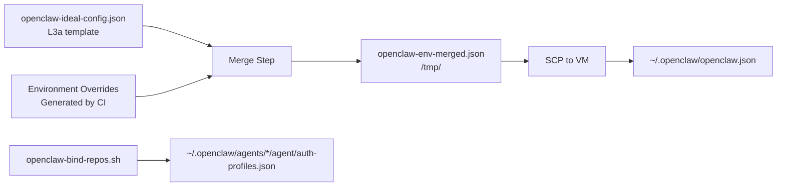

# OpenClaw Gateway Deployment

**Last Updated:** 2026-06-10  
**Status:** CURRENT

---

## Overview

The OpenClaw gateway is deployed as **Layer 3b** in a three-layer stack:

| Layer | Component | Purpose |
|-------|-----------|---------|
| **L1** | terraform-hcloud-linux-vm | VM provisioning |
| **L2** | linux-headless-setup | OS bootstrap (security, runtimes, monitoring) |
| **L3a** | linux-desktop-seed | Deploy orchestration, version API, VM ops |
| **L3b** | openclaw-gateway (this repo) | Agent runtime, Discord integration, model management |

**This document describes L3b deployment only.** For full-stack deployment, see [linux-desktop-seed deployment docs](https://github.com/DarojaAI/linux-desktop-seed/blob/main/docs/DEPLOYMENT.md).

---

## Deployment Methods

### Method 1: Via L3a Orchestration (Recommended)

The gateway is normally deployed as part of the full L3a → L3b pipeline:

```bash
# From linux-desktop-seed repo
gh workflow run deploy.yml \
  --repo DarojaAI/linux-desktop-seed \
  -f action=apply \
  -f environment=test
```

This:
1. Clones openclaw-gateway to `/tmp/openclaw-gateway/`
2. Runs `scripts/install/deploy.sh`
3. Merges config from `linux-desktop-seed/config/openclaw-ideal-config.json` + environment overrides
4. Binds target repos (via `scripts/openclaw-bind-repos.sh`)
5. Installs systemd unit `openclaw-gateway.service`
6. Starts the gateway

### Method 2: Manual Gateway-Only Deploy

For testing gateway changes without full L3a redeploy:

```bash
# On the target VM
cd /opt/openclaw-gateway
git pull origin main

# Restart the gateway
sudo systemctl restart openclaw-gateway

# Check status
sudo systemctl status openclaw-gateway
journalctl -u openclaw-gateway -f
```

---

## Configuration Pipeline

The gateway configuration is assembled from multiple sources at deploy time:



### Configuration Sources

| File | Purpose | Lives In |
|------|---------|----------|
| `config/openclaw-ideal-config.json` | Base template (no env-specific data) | linux-desktop-seed (L3a) |
| Generated env overrides | Discord channel IDs, tokens, guild IDs | Generated by CI from GitHub secrets |
| `/tmp/openclaw-env-merged.json` | Merged config (temporary) | Build artifact |
| `~/.openclaw/openclaw.json` | Final deployed config | VM |
| `~/.openclaw/agents/*/agent/auth-profiles.json` | Per-agent API credentials | Generated by bind-repos script |

### The DAT Contract (Non-Negotiable)

**All environment-specific data MUST come from GitHub environment variables/secrets.**

Never hardcode in `openclaw-ideal-config.json`:
- ❌ Discord channel IDs
- ❌ Discord guild IDs
- ❌ Discord user IDs
- ❌ Bot tokens
- ❌ API keys

If you hardcode an ID in ideal config, every environment gets it — test bot responds in prod channels.

**Correct approach:**
```json
// In openclaw-ideal-config.json (WRONG)
"channels": {
  "discord": {
    "guilds": {
      "1485047825967480862": {}  // ❌ Hardcoded
    }
  }
}

// Generated env override (CORRECT)
"channels": {
  "discord": {
    "guilds": {
      "${OPENCLAW_DISCORD_GUILD_ID}": {}  // ✅ Env var
    }
  }
}
```

See [config-management.md](config-management.md) for full config governance.

---

## Environment Topology

| Environment | VM IP | Bot Name | Bot Client ID | Channel | Purpose |
|-------------|-------|----------|---------------|---------|---------|
| **test** | 178.105.6.42 | `co` | 1485038437395599460 | 1493278190540427395 | CI validation |
| **head** | TBD | `co-head` | TBD | TBD | Staging |
| **prod** | TBD | `coder` | TBD | TBD | Production |

Each environment has:
- Its own VM
- Its own Discord bot
- Its own channel allowlist
- Isolated config and secrets

---

## Directory Structure (On VM)

```
~/.openclaw/
├── openclaw.json                     # Main config (merged from L3a)
├── agents/
│   ├── main/                         # Default agent
│   │   ├── agent/
│   │   │   ├── auth-profiles.json   # API credentials
│   │   │   └── models.json          # Model catalog
│   │   └── sessions/                # Session history
│   └── [other-agents]/              # Per-agent directories
├── memory/
│   └── *.sqlite                     # Agent memory files
└── skills/                          # Custom skills (optional)

/opt/openclaw-gateway/               # Cloned repo (optional)
└── ...

/var/log/openclaw/                   # Logs (if configured)
└── gateway.log
```

---

## Systemd Unit

The gateway runs as a systemd service:

```ini
[Unit]
Description=OpenClaw Gateway
After=network.target

[Service]
Type=simple
User=desktopuser
WorkingDirectory=/home/desktopuser
ExecStart=/usr/bin/node /path/to/openclaw/bin/openclaw.js
Restart=on-failure
RestartSec=5
Environment=NODE_ENV=production

[Install]
WantedBy=multi-user.target
```

**Service commands:**
```bash
sudo systemctl start openclaw-gateway
sudo systemctl stop openclaw-gateway
sudo systemctl restart openclaw-gateway
sudo systemctl status openclaw-gateway
journalctl -u openclaw-gateway -f
```

---

## Health Checks

### 1. Gateway Health Endpoint

```bash
curl http://localhost:18789/health
# Expected: {"status": "ok", "version": "..."}
```

### 2. Discord Bot Online

Check Discord — bot should show as online with green indicator.

### 3. Session Test

Send a test message in the configured channel. Bot should respond.

### 4. Journal Logs

```bash
journalctl -u openclaw-gateway --since "5 minutes ago"
# Look for startup confirmation, no errors
```

---

## Troubleshooting

### Gateway Won't Start

**Symptoms:**
- `systemctl status openclaw-gateway` shows "failed"
- Journal shows config validation errors

**Diagnosis:**
```bash
journalctl -u openclaw-gateway -n 100
# Look for schema validation errors
```

**Common causes:**
1. **Config schema mismatch** — `openclaw.json` doesn't match schema for installed version
2. **Missing secrets** — API keys not in `auth-profiles.json`
3. **Port conflict** — 18789 already in use

**Fix:**
```bash
# Validate config
openclaw config validate

# Check schema version
openclaw --version
cat ~/.openclaw/openclaw.json | jq '.version'

# Re-merge config from L3a
cd /path/to/linux-desktop-seed
bash scripts/remote/merge-openclaw-config.py
```

See [troubleshooting/context.md](troubleshooting/context.md) for context size issues.

### Bot Not Responding in Discord

**Symptoms:**
- Bot is online but doesn't respond to messages
- No errors in journal

**Diagnosis:**
```bash
# Check channel allowlist
cat ~/.openclaw/openclaw.json | jq '.channels.discord.guilds'

# Verify bot has permissions in Discord
# Required: Read Messages, Send Messages, Embed Links
```

**Common causes:**
1. **Wrong channel ID** — bot allowlist doesn't include the channel you're messaging in
2. **Missing Discord permissions** — bot lacks message permissions
3. **Bot token expired** — Discord revoked the token

**Fix:**
```bash
# Verify channel ID matches config
echo $OPENCLAW_DISCORD_CHANNEL_ID

# Restart with fresh config
sudo systemctl restart openclaw-gateway
```

### High Memory Usage

**Symptoms:**
- Gateway RSS > 2GB
- OOM kills in journal

**Diagnosis:**
```bash
# Check current memory
ps aux | grep openclaw
# Or
systemctl status openclaw-gateway | grep Memory

# Check session count
ls -1 ~/.openclaw/agents/*/sessions/*.jsonl | wc -l
```

**Fix:**
```bash
# Compact old sessions
openclaw sessions compact --older-than 30d

# Or clean up via script
bash /path/to/linux-desktop-seed/scripts/monitor/session-cleanup.sh
```

---

## Version Management

### Check Current Version

```bash
openclaw --version
# Or
curl http://localhost:18789/version
```

### Upgrade Gateway

**Via L3a (recommended):**
```bash
# From linux-desktop-seed repo
gh workflow run deploy.yml -f action=apply -f environment=test
```

**Manual:**
```bash
# On VM
cd /opt/openclaw-gateway
git pull origin main
npm install  # if dependencies changed
sudo systemctl restart openclaw-gateway
```

---

## Security

### API Keys & Tokens

- Stored in `~/.openclaw/agents/*/agent/auth-profiles.json`
- Readable only by `desktopuser`
- Never committed to git
- Rotated via L3a redeploy

### Gateway Auth Token

The gateway API (port 18789) requires a bearer token:

```bash
curl -H "Authorization: Bearer $GATEWAY_AUTH_TOKEN" \
  http://localhost:18789/api/sessions
```

This token is generated at deploy time and stored in `openclaw.json`.

### Discord Bot Token

Stored in GitHub secrets, injected at deploy time. Never visible in logs or config files in the repo.

---

## Related Documentation

- [architecture.md](architecture.md) — DAT contract, config pipeline, environment topology
- [config-management.md](config-management.md) — Configuration governance
- [workspace-routing.md](workspace-routing.md) — Workspace directory routing
- [troubleshooting/context.md](troubleshooting/context.md) — Context size issues

---

**End of Document**
