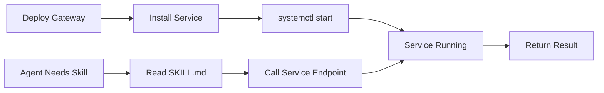

# OpenClaw Gateway Skills Guide

**Last Updated:** 2026-06-10  
**Status:** CURRENT

---

## Overview

Skills are reusable procedures that agents can invoke to perform specific tasks. Skills in OpenClaw are **Markdown-based** — each skill is a `SKILL.md` file that describes what the skill does, when to use it, and how to execute it.

This document explains how to create, register, and use skills in the gateway.

---

## Skill Types

| Type | Purpose | Example |
|------|---------|---------|
| **Built-in** | Core gateway functionality | session-commands, model-management |
| **Service** | Wraps an external service | viz (diagram rendering) |
| **Agent-specific** | Bound to a specific agent/repo | Custom skills in agent workspace |
| **Shared** | Reusable across all agents | Maintenance, troubleshooting |

---

## Skill Structure

### Directory Layout

```
config/skills/
├── session-commands/
│   └── SKILL.md
├── model-management/
│   └── SKILL.md
├── maintenance/
│   └── SKILL.md
└── viz/
    └── SKILL.md
```

Each skill lives in its own directory under `config/skills/`. The `SKILL.md` file is the skill definition.

### SKILL.md Format

```markdown
# Skill Name

Brief one-line description.

## When to Use This Skill

Explain the conditions that trigger this skill.

## Steps

1. Step one
2. Step two
3. Step three

## Examples

\`\`\`bash
# Example command
openclaw do-thing
\`\`\`

## Notes

Any warnings, prerequisites, or edge cases.
```

**Critical:** The skill must be **self-contained** — all information needed to execute the skill must be in the SKILL.md file. Agents read the skill, then follow it.

---

## Creating a New Skill

### Step 1: Choose a Skill Name

Pick a name that describes the capability:
- ✅ `analyze-code-patterns`
- ✅ `restart-service`
- ❌ `do-stuff`
- ❌ `helper`

Use kebab-case (lowercase, hyphens).

### Step 2: Create the Directory

```bash
mkdir -p config/skills/your-skill-name
```

### Step 3: Write SKILL.md

```bash
cat > config/skills/your-skill-name/SKILL.md << 'EOF'
# Your Skill Name

One-line description of what this skill does.

## When to Use This Skill

Describe the trigger condition. Example:
- Use this skill when the user asks to analyze code for patterns
- Use this skill when you need to compare two files for similarity

## Steps

1. Read the source file
2. Extract patterns using tool X
3. Compare against known patterns in the knowledge base
4. Return results

## Examples

\`\`\`bash
# Example 1: Analyze a single file
openclaw analyze patterns.py
\`\`\`

## Notes

- Requires X tool to be installed
- Only works on Python files
- Results are cached for 24 hours
EOF
```

### Step 4: Register the Skill (Optional)

If the skill is service-backed (like `viz`), you need a systemd unit and an install script:

```bash
# Create systemd unit
cat > etc/systemd/user/openclaw-your-skill.service << 'EOF'
[Unit]
Description=OpenClaw Skill: Your Skill
After=network.target

[Service]
Type=simple
ExecStart=/path/to/your-skill-server
Restart=on-failure

[Install]
WantedBy=default.target
EOF

# Create install script
cat > scripts/services/install-your-skill-service.sh << 'EOF'
#!/bin/bash
set -euo pipefail

echo "Installing your-skill service..."
mkdir -p ~/.config/systemd/user
cp etc/systemd/user/openclaw-your-skill.service ~/.config/systemd/user/
systemctl --user daemon-reload
systemctl --user enable openclaw-your-skill.service
systemctl --user start openclaw-your-skill.service
EOF

chmod +x scripts/services/install-your-skill-service.sh
```

---

## Skill Discovery

Agents discover skills in two ways:

### 1. Gateway-Level Skills

Skills in `config/skills/` are available to all agents automatically. The gateway includes them in the agent's available skills list.

**How it works:**
1. Agent starts
2. Gateway scans `config/skills/`
3. Reads each `SKILL.md`
4. Makes skill descriptions available to the agent

### 2. Workspace-Bound Skills

Skills specific to a repo/agent live in the agent's workspace:

```
~/.openclaw/agents/your-agent/
└── skills/
    └── custom-skill/
        └── SKILL.md
```

The gateway binds repos to agents via `scripts/openclaw-bind-repos.sh`. If the repo contains skills, they're copied into the agent workspace.

---

## Using Skills from Agents

### In Agent Prompts

Skills are loaded into agent context automatically. The agent sees:

```
Available Skills:
- session-commands: Manage session state (/reset, /compact, /stop)
- model-management: Switch models, list available models
- viz: Render diagrams (Mermaid, Graphviz, Chart.js)
- your-custom-skill: Your skill description
```

The agent can then:
1. Recognize when a skill applies
2. Read the SKILL.md for the full procedure
3. Follow the steps

### Example Agent Turn

**User:** "Show me a diagram of the current architecture"

**Agent reasoning:**
1. Check available skills
2. Find `viz` skill
3. Read `config/skills/viz/SKILL.md`
4. Follow the steps in the skill
5. Call the viz service with the diagram definition
6. Return the rendered image to the user

---

## Service-Backed Skills

Some skills (like `viz`) require a background service. These skills have:

1. **SKILL.md** — Procedure for agents to follow
2. **Service code** — The actual implementation (e.g., `config/services/viz/render-server.js`)
3. **Systemd unit** — Keeps the service running (e.g., `etc/systemd/user/openclaw-viz.service`)
4. **Install script** — Deploys the service (e.g., `scripts/services/install-viz-service.sh`)

### Service Lifecycle



**Example: viz skill**

1. L3a deploys gateway → runs `scripts/services/install-viz-service.sh`
2. Install script copies systemd unit, runs `systemctl --user enable openclaw-viz`
3. Service starts on boot: `http://localhost:3456`
4. Agent reads `config/skills/viz/SKILL.md`
5. Agent calls `http://localhost:3456/render` with diagram definition
6. Service returns PNG
7. Agent sends PNG to user

---

## Testing Skills

### Manual Test

```bash
# Read the skill
cat config/skills/your-skill/SKILL.md

# Follow the steps manually
openclaw whatever-the-skill-says
```

### Automated Test (BATS)

```bash
# Create test file
cat > tests/your-skill.bats << 'EOF'
#!/usr/bin/env bats

@test "your-skill: SKILL.md exists" {
  [ -f "config/skills/your-skill/SKILL.md" ]
}

@test "your-skill: has required sections" {
  grep -q "## When to Use This Skill" config/skills/your-skill/SKILL.md
  grep -q "## Steps" config/skills/your-skill/SKILL.md
}

@test "your-skill: service responds" {
  # If service-backed
  curl -f http://localhost:PORT/health
}
EOF

chmod +x tests/your-skill.bats
bats tests/your-skill.bats
```

---

## Best Practices

### 1. One Skill, One Purpose

Each skill should do **one thing well**. Don't create a "do-everything" skill.

**Bad:** `utility-functions` skill with 10 unrelated procedures  
**Good:** `restart-service` skill that just restarts services

### 2. Self-Contained Instructions

Everything the agent needs must be in SKILL.md. No external dependencies unless explicitly documented.

**Bad:**
```markdown
## Steps
1. Run the script (you know which one)
2. Check the output
```

**Good:**
```markdown
## Steps
1. Run: `bash /opt/openclaw-gateway/scripts/check-health.sh`
2. Expected output: "All systems operational"
3. If output contains "ERROR", escalate to user
```

### 3. Clear Trigger Conditions

The "When to Use This Skill" section must be **specific**.

**Bad:**
```markdown
## When to Use This Skill
Use this when you need to do stuff.
```

**Good:**
```markdown
## When to Use This Skill
Use this skill when:
- The user explicitly asks to render a diagram
- You have Mermaid/Graphviz/Chart.js syntax ready
- The diagram is for Discord (needs PNG output)
```

### 4. Examples > Prose

Show, don't tell. Include working examples.

**Bad:**
```markdown
You can use various flags to customize output.
```

**Good:**
```markdown
\`\`\`bash
# Render as PNG
openclaw viz --format png diagram.mmd

# Custom size
openclaw viz --width 800 --height 600 diagram.dot
\`\`\`
```

---

## Skill Versioning

Skills are versioned with the gateway. When the gateway is upgraded, skills are upgraded automatically.

**No separate skill versions.** If a skill's behavior changes, document it in the SKILL.md changelog section.

---

## Related Documentation

- [architectural-boundaries.md](architectural-boundaries.md) — When to create a skill vs. a tool (mcp-tooling)
- [workspace-routing.md](workspace-routing.md) — How workspace-bound skills work
- [viz skill README](../config/services/viz/README.md) — Example service-backed skill

---

**End of Document**
